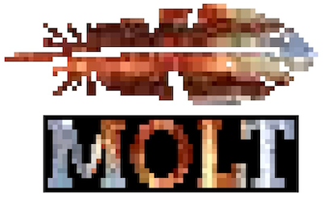

# Molt -- More Or Less TCL

[](https://crates.io/crates/molt)



Molt is a minimal implementation of the TCL language for embedding in Rust apps and for
scripting Rust libraries.  See [The Molt Book](https://wduquette.github.io/molt) for details
and user documentation.

## New in Molt 0.2.2

### Dictionaries and the `dict` command

Molt now supports TCL dictionary values.  The `dict` command provides the following
subcommands:

*   dict create
*   dict exists
*   dict get
*   dict keys
*   dict remove
*   dict set
*   dict size
*   dict unset
*   dict values

Other `dict` subcommands will be added over time.

## New in Molt 0.2.0

### Associative Arrays

Molt now includes TCL's associative array variables:

```text
% set a(1) "Howdy"
Howdy
% set a(foo.bar) 5
5
% puts [array get a]
1 Howdy foo.bar 5
```

### The Expansion Operator

Molt now supports TCL's `{*}` operator, which expands a single
command argument into multiple arguments:

```text
% set a {a b c}
a b c
% list 1 2 $a 3 4
1 2 {a b c} 3 4
% list 1 2 {*}$a 3 4
1 2 a b c 3 4
```

### More `info` Subcommands

Molt now supports the following subcommands of the `info` command:

* `info args`
* `info cmdtype`
* `info body`
* `info default`
* `info exists`
* `info globals` (no glob-filtering as yet)
* `info locals` (no glob-filtering as yet)
* `info procs`

### Rust API Change: Test Harness

The Molt test harness code has moved from `molt_shell:test_harness` to `molt::test_harness`,
so that it can be used in the `molt/tests/tcl_tests.rs` integration test.

### Rust API Change: Variable Access

The addition of array variables required changes to the `molt::Interp` struct's API for
setting and retrieving variables.  In particular, the `molt::Interp::var`,
`molt::Interp::set_var`, and `molt::Interp::set_and_return` methods now take the variable
name as a `&Value` rather than a `&str`; this simplifies client code, and means that most
commands implemented in Rust that work with variables don't need to care whether the
variable in question is a scalar or an array element.

### Rust API Change: Command Definition

Defining Molt commands in Rust has been simplified.  

First, the `Command` trait has been removed.  It was intended to provide a way to
attach context data to a command; but it was not very good for mutable data, and had
no way to share data among related commands (a common pattern).

Second, the interpreter's context cache has been improved.  Multiple commands can share a
context ID (and hence access to the shared context); and the cached data will be dropped
automatically when the last such command is removed from the interpreter.

Third, there is now only one command function signature:

```
fn my_command(interp: &mut Interp, context_id: ContextID, argv: &[Value]) -> MoltResult {
    ...
}
```

Commands that don't use a cached context should be defined as follows:

```
fn my_command(interp: &mut Interp, _: ContextID, argv: &[Value]) -> MoltResult {
    ...
}
```

See [The Molt Book](https://wduquette.github.io/molt) and the Rust doc for examples.

## Coming Attractions

At this point Molt is capable and robust enough for real work, though the Rust-level API is
not yet completely stable.  Standard Rust `0.y.z` semantic versioning applies: ".y" changes
can break the Rust-level API, ".z" changes will not.

*   Feature: Regex and Glob pattern matching by Molt commands
*   Testing improvements
*   Documentation improvements

## Why Molt Exists

Using Molt, you can:

*   Create a shell interpreter for scripting and interactive testing of your Rust crates.
*   Provide your Rust applications with an interactive REPL for debugging and
    administration.
*   Extend your Rust application with scripts provided at compile-time or at run-time.
*   Allow your users to script your applications and libraries.

See the [`molt-sample` repo](https://github.com/wduquette/molt-sample) for a sample Molt client
skeleton.

## Molt and Standard TCL

Molt is intended to be lightweight and require minimal dependencies, so that it can be added
to any project without greatly increasing its footprint.  (At present, the core
language is a single library create with no dependencies at all!)  As such, it does not provide
all of the features of Standard TCL (e.g., TCL 8.6).

At the same time, Molt's implementation of TCL should be consistent with TCL 8.6 so far as it
goes.  Some archaic commands and command features are omitted; some changes
are made so Molt works better in the Rust ecosystem. (E.g., Molt's notion of whitespace is
the same as Rust's.) All liens against Standard TCL are documented in
the [The Molt Book](https://wduquette.github.io/molt).

No effort has been made to make the Rust-level API for extending Molt in Rust look like
Standard TCL's C API; rather, the goal is to make the Rust-level API as simple and ergonomic
as possible. **Note**: A big part of this effort is defining and refining the Rust API used
to interact with and extend the interpreter. If you have comments or suggestions for
improvement, please contact me or write an issue!

## Building and Installation

The easiest approach is to get the latest Molt through `crates.io`.  Look for the
`molt`, `molt-shell`, and `molt-app` crates, or add them to your dependencies list
in `cargo.toml`.

To build Molt:

*   Install the latest stable version of Rust (1.38.0 at time of writing)
*   Clone this repository
*   To build:

```
$ cd .../molt
$ cargo build
```

* To run the interactive shell

```
$ cargo run shell
```

* To run just the language test suite

```
$ cargo run test molt/tests/all.tcl
```

As of Molt 0.2.0, the language tests are also run by `cargo test`; however, it's much easier to
see the output of the individual tests using the above command.

## Dependencies

At present, the only dependency required by the Molt core is
[indexmap](https://docs.rs/indexmap/1.3.0/indexmap/).

## Acknowledgements

I've gotten help from many people in this endeavor; here's a (necessarily partial) list.

* Mary Duquette, for the Molt logo
* Jonathan Castello, for general Rust info
* Kevin Kenny, for help with TCL numerics and general encouragement
* Don Porter, for help with TCL parsing
* rfdonnelly, for the crates.io badge, etc.
* Various folks from users.rust-lang.org who have answered my questions:
    * Krishna Sannasi, for help getting `Value` to work with arbitrary user data types
    * Yandros, for pointing me at `OnceCell` and `UnsafeCell`.
    * jethrogb, for help on how to use `Ref::map` to return a `Ref<T>` of a component deep within
      a `RefCell<S>` from a function.  (Mind you, once I got it working and gave it a try I
      tore it out again, because of `BorrowMutError` panics.  But I had to try it.)
